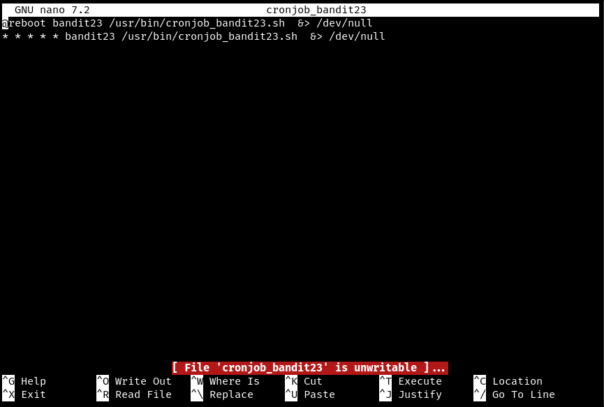
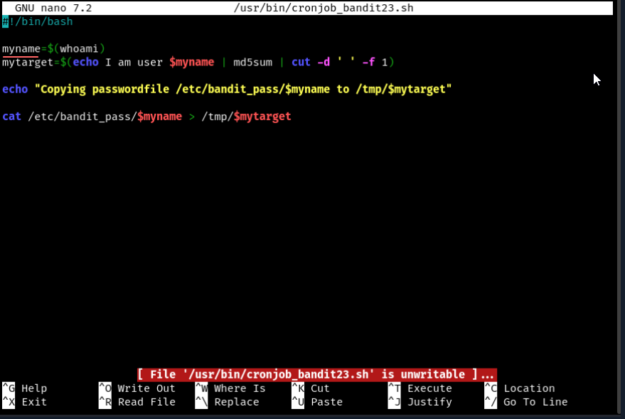

# ted

# Bandit lvl 18

In this level we are told the password is stored in the readme file in the home directory. A problem arises when upon logging in with ssh we are immediately booted out...

Ok let us look at the login page. `ssh bandit18@bandit.labs.overthewire.org -p 2220`


We are booted immediately. Maybe we can use the telnet protocol to login? Telnet doesn't provide the encryption that ssh does but the login problem might be with ssh. `telnet bandit18@bandit.labs.overthewire.org -p 2220`

 

For the uninintiated telnet and ssh are two protocols that allow you to connect to another server over the internet or network. Telnet sends your information in plaintext meaning that your username and password are easily visible whereas ssh encrypts this information. Think of logging into a website where you enter a username and password, that usually uses a protcol called https and this works similar to ssh and telnet. 

Alright back to the problem at hand, we are using the wrong format for a telnet login but the problem lies within the bash shell so switching protocols shouldn't be the fix. Let's stick with ssh and try adding something else to the command.... how about removing the .bashrc file? This is the file that is logging us out so perhaps removing it will solve our problems? 


Ok that didn't work, we were denied the permission to remove the .bashrc file. Let's try to understand this specific file a bit more.


It looks like .bashrc is a file that you can't remove since it allows you to interact with your terminal. Let's move on then. How about a little internet search for our problem?  


We might have a winner! 


Easy. Once we login all we have to do is cat the readme file for the password. 

_But why does this work?_

Well, when we login normally with ssh it runs the default shell that is specified in the user config. This default shell could be /bin/bash which loads the .bashrc file on login. If there is an issue in the .bashrc file we may get kicked out because the shell fails to initialize. To get around this we can use the `-t` flag which forces ssh to allocate a terminal that ensures /bin/bash runs in an interactive session and `/bin/bash` which overrides the default shell and bypasses the quirks of .bashrc. In essence `-t` gives us an interactive terminal and `/bin/bash` gives us a shell that doesn't load the corrupt .bashrc file.


# Bandit Lvl 19

In this level the password is stored in the /etc/bandit_pass directory but we lack the permissions to read it. Perhaps the setuid binary can help us... 


It was worth a shot.

Let's get some information on that file in the home directory.


Ok, not a whole lot of information to work with though it is important to note that the file is executable. Let's try and see what is actually inside this bandit20-do file.


Ok looks like the file is not human-readable but we have some information in there nonetheless. Let's try extracting the human-readable information. 


This file let's us run a command as another user which might be exactly what we need. An example is given: `%s id`. But what does this mean? 

Let's freestyle. (remember ./ before a file allows us to execute that file ONLY if it has executable properties)


Ok we seem to have stumbled on the right formatting for the use of this setuid binary. `./bandit20-do <command>` runs the command with the permissions given by the bandit20-do file. Let's zero in on that last command. 


The euid tells us that our executable permissions are that of the user bandit20. Since each user is able to access the password for their level we should be able to use bandit20-do to cat the password for this level.


Voila!

# Bandit lvl 20 #netcat 
---
- setuid binary in home directory 
1) makes connection to local host on port we specify as a command line argument
2) reads line of text from connection and compares it to the password in the previous level
3) if the password is correct it will transmit the password for the next level 

Doing `file suconnect` gives us, 
```
suconnect: setuid ELF 32-bit LSB executable, Intel 80386, version 1 (SYSV), dynamically linked, interpreter /lib/ld-linux.so.2, BuildID[sha1]=4c95669a71860e303b714721dde9020213ad3c9a, for GNU/Linux 3.2.0, not stripped
```

![[bandit20.1.png]]
- `./suconnect <port>` is the command but what should the port be? 
- do not think nmap will show us the port 
- netcat has some interesting commands available namely `nc -e` and `nc -c` 
- `nc -c` allows us to specify a file that executes after connection
- `nc -e` specifies shell command to execute after connection 
- can I combine `./suconnect` `nc` and the password from the prev lvl?

Let's try to create a new file with the bandit 20 password and change it to be executable so we can use the `nc -e` command.
![[bandit20.2.png]]

![[bandit20.3.png]]
- ok that did not seem to work :/

Can we use netcat while connected to the bandit server? Let's try accessing the password file for bandit20 and then sending it to another port with netcat. We should then be able to use `./suconnect` in theory of course. 

![[bandit20.4.png]]

![[bandit20.5.png]]
- we may have to make a directory to copy this file to
- looks like our directory making permissions are nonexistent
- maybe netcat will let the bandit20 file stay in the bandit_pass folder even if we send it over to another port?

![[bandit20.6.png]]
- nope..... but expected
- it also seems from out terminal `nc -l bandit.labs.overthewire.org 1499 > pass.txt ` doesn't work either but this makes sense since we don't have knowledge of that port existing, we can't send to a non-existing port
- maybe now an nmap scan? 

![[bandit20.7.png]]
- what can we do with the open ports information?

![[bandit20.8.png]]
- it seems to be waiting for something 
- maybe we can send the bandit20 password to this port

![[bandit20.9.png]]
- not sure if this strategy will work for all ports but should start with port 5060

Ok new plan, i don't believe in working outside the server let's work from in the server. If we can send the password as a string to the port we want we don't have to worry about transferring the bandit20 file from the bandit_pass directory. 

![[bandit20.10.png]]
We are setting up a listener with netcat so that when we do run `./suconnect <port>` we will hopefully get the new password back. The `&` is there so that netcat doesn't stall out. We also need to echo the password before this netcat command so `echo "bandit20pass"` should do the trick.  

![[bandit20.11.png]]
- without the `&`, the command stalls out

![[bandit20.12.png]]
- light work

In essence the `./suconnect` command needed a port to read or in this case listen the password off of. Netcat allowed us to do this with the `nc -l` command which set up a listener on the specified port. All we had to tweak was the hostname, port, and make it executable so the command doesn't stall out. Alternatively we could open a new terminal connected to the server and remove the `&` and that should work as well. 

# Bandit lvl 21 #cron
---
- a program is running automatically at regular intervals from cron
- cron is a time-based job scheduler
- look in /etc/cron.d/ for the config and see what command is being executed

Logging in and cd'ing over to the /etc/cron.d/ directory we see,


- Is this the command that is running? 
- what is the time interval? 
- what does this even mean? 

We have a file in the cronjob so let's try reading it. 


- seems simple enough? 

Nope, attempting to login with that password into lvl 22 fails. But it looks like we can work backwards and figure out what the cronjob is doing. We know the password for the next level is usually stored in `/etc/bandit_pass` so,
`cat /etc/bandit_pass/bandit22 > /tmp/t7O6lds9S0RqQh9aMcz6ShpAoZKF7fgv` is most likely dumping the password into the `/tmp` folder. If we cat the file in the `/tmp` folder we should be able to read the password.


- EZ


We are denied permission to find out the intervals on which this password dump occurs but one can theorize it is scheduled to happen once we login. 

# Bandit lvl 22 #cron
---
- a program is running automatically at regular intervals from cron
- look in /etc/cron.d/ for the config and see what command is being executed

- using `nano` to open the file we see something similar is happening in this cronjob compared to the last level 


- opening /usr/bin/cronjob_bandit23.sh we see this script running

Let's piece this puzzle,

```bash
cat /etc/bandit_pass/$myname > /tmp/$mytarget
```
- is dumping the password into a temporary directory 
- we need to find out what `$mytarget` is 
- `$myname` is given by `$(whoami)` which is simply `$$bandit22`

Before we go on trying to understand the script we can simply run the script to see what is going on,  


- but this is the password to get into this level


- `$$` seems to be a hashing function 

Since there was something about an md5 hash in the script and the file in the /tmp directory seems to be a hash let's try and crack it. 


- ok looks like the file with the password for bandit22 is in /tmp/I am user bandit22 where "I am user bandit22" is hashed
- however we want the password for bandit23 

Let's look at the script again,


- we can change the `myname` variable to bandit23 which might let us catch the password dump of bandit 23  


- voila 
- note that 8ca319486bfbbc3663ea0fbe81326349 is simply the md5 hash of "I am user bandit23"
